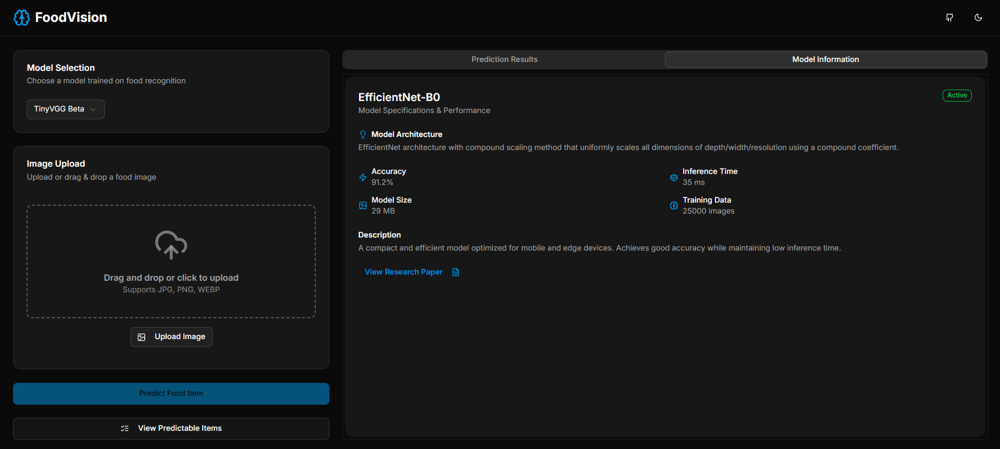
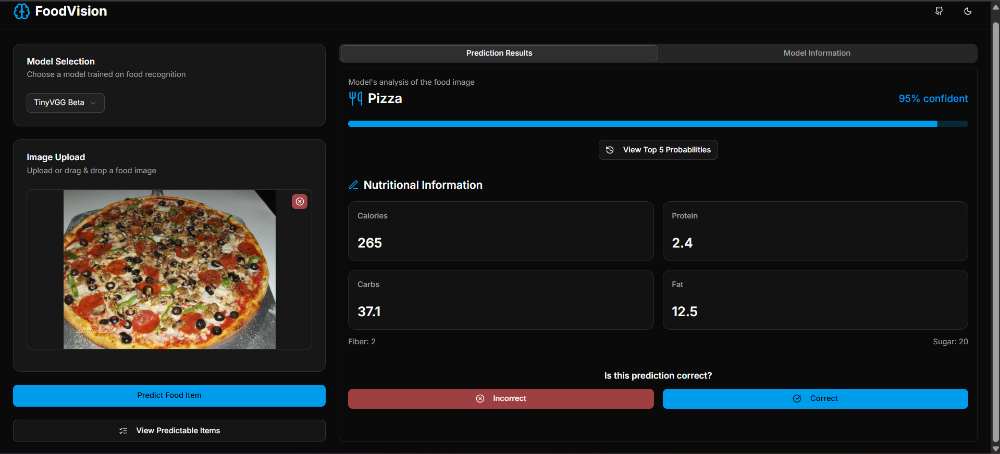
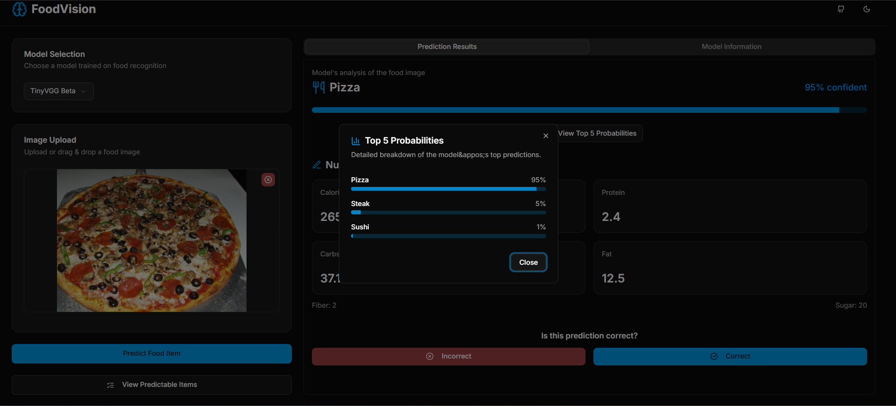

# 🍕🥩🍣 FoodNet

FoodNet is a modern web application that uses deep learning to recognize food items from images and provide nutritional information. Upload a food photo, and FoodNet will predict the dish and show you its calories, protein, carbs, fat, fiber, and sugar content. The app is designed for foodies, fitness enthusiasts, and anyone curious about what's on their plate!

---

## 🚀 Features
- **Image Upload & Prediction:** Upload or drag-and-drop a food image to get instant predictions.
- **Nutritional Info:** See detailed nutrition facts for the predicted food item.
- **Model Selection:** Choose between different trained models (TinyVGG, Model 0, Model 1).
- **Top 5 Probabilities:** View the model's top 5 guesses and their confidence scores.
- **Feedback System:** Help improve the model by submitting corrections if the prediction is wrong.
- **Predictable Items List:** Browse/search the list of foods the model can recognize.
- **Modern UI:** Responsive, clean, and user-friendly interface built with Next.js and Tailwind CSS.

---

## 🛠️ Tech Stack
- **Frontend:** Next.js 15, React, TypeScript, Tailwind CSS, Shadcn UI, React Query
- **Backend:** FastAPI, Python, PyTorch, Supabase (for data storage/feedback)
- **Deployment:** Vercel (frontend), Render (backend)
- **Other:** Supabase, dotenv, PIL, TorchVision

---

## 🖥️ Local Setup

### 1. Clone the repository
```bash
git clone https://github.com/yourusername/FoodNet.git
cd FoodNet
```
### 2. Backend Setup

```bash
cd backend
python -m venv backvenv
# Activate the virtual environment (Windows)
.\backvenv\Scripts\Activate.ps1
# Or (Linux/macOS)
source backvenv/bin/activate
pip install -r requirements.txt
# Add your .env file with SUPABASE_URL, SUPABASE_KEY, SUPABASE_BUCKET
python -m uvicorn backend.server:app --reload
```
### 3. Frontend Setup
```bash
cd ../frontend
npm install
# Add your .env.local with NEXT_PUBLIC_BACKEND_URL=http://localhost:8000
npm run dev
```
* Visit http://localhost:3000 in your browser.

---
### 🌱 Future Plans

* Full Food101 Support: Expand model to recognize all 101 classes from the Food101 dataset.
* User Accounts: Allow users to save predictions and track nutrition history.
* Mobile App: Build a cross-platform mobile version.
* Better Nutrition Data: Integrate with more comprehensive nutrition APIs.
* Model Improvements: Experiment with EfficientNet, ResNet, and other architectures.
* Internationalization: Support for multiple languages.
---
### 🤝 Contributing

We welcome contributions! To get started:

1. Fork this repo and create a new branch for your feature or bugfix.
2. Follow the code style and add clear comments.
3. Test your changes locally.
4. Open a pull request with a clear description of your changes.

<h3>Please:</h3>

* Be respectful and constructive in discussions.
* Open issues for bugs, feature requests, or questions.
* For major changes, open an issue first to discuss what you’d like to change.
---
### 📸 Screenshots





---
### ✨ Extras
* Demo: [Live App on Vercel](https://food-net.vercel.app/)
* Backend: [Live API on Render](https://foodnet-vs3e.onrender.com/)
* Contact: amalv2004@gmail.com
* Inspiration: Built for food lovers, by food lovers!